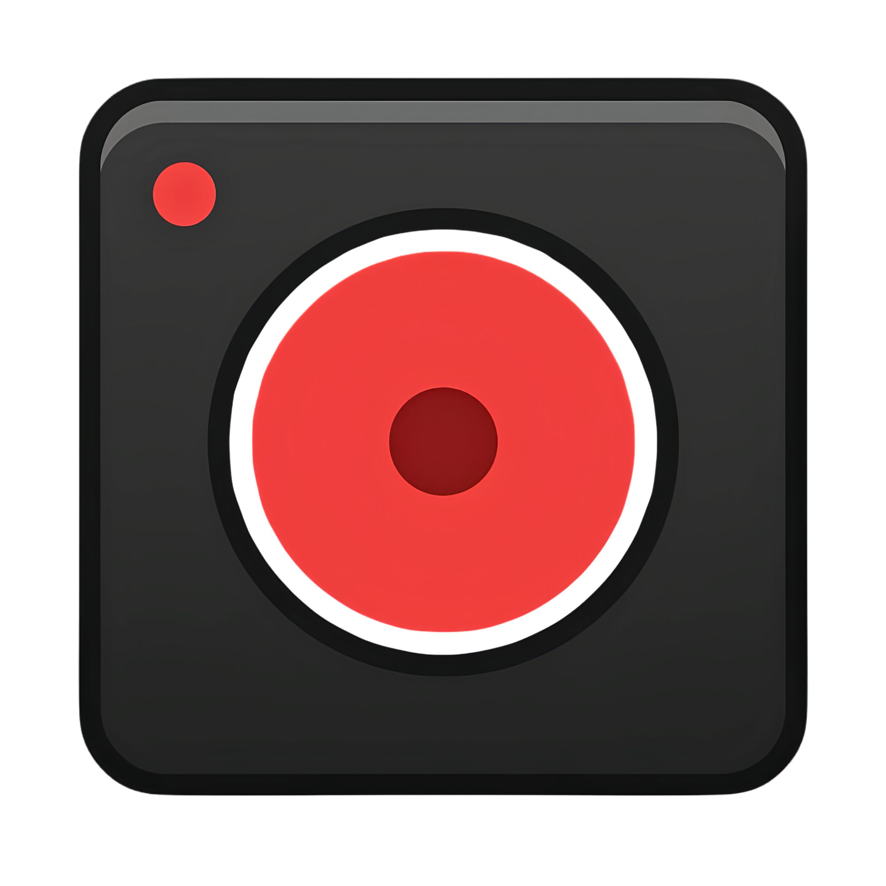

# LocalLoom

Local-first Loom-style screen recorder as Chrome Manifest V3 extension.



## Requirements

- macOS, Windows, or Linux
- Google Chrome (latest stable)
- Node.js 18+
- npm 9+

## Quick Start (Development)

```bash
npm install
npm run dev
```

Then load extension in Chrome:

1. Open `chrome://extensions`
2. Enable **Developer mode**
3. Click **Load unpacked**
4. Select `.output/chrome-mv3-dev`

## Build (Production)

```bash
npm run build
```

Build output is generated in `dist/`.

To test production build in Chrome:

1. Open `chrome://extensions`
2. Enable **Developer mode**
3. Click **Load unpacked**
4. Select `dist`

## How to Use

1. Click extension icon in Chrome toolbar
2. Choose recording settings (camera, microphone, system audio)
3. Click **Start Recording**
4. Select tab/window/screen in Chrome share picker
5. Use recorder controls: pause, resume, stop, cancel
6. Export from recorder or open library for playback, trim, rename, delete, export

## Keyboard Shortcuts

- Start recorder: `Command+Shift+R` (macOS) / `Ctrl+Shift+R` (Windows/Linux)
- Open library: `Command+Shift+L` (macOS) / `Ctrl+Shift+L` (Windows/Linux)

You can customize shortcuts in `chrome://extensions/shortcuts`.

## Project Structure

- `src/popup/*` popup UI
- `src/recorder/*` recorder UI and composition pipeline
- `src/library/*` local recording library and trim UI
- `src/background/index.ts` extension background service worker
- `src/shared/*` settings, storage, media helpers, shared types

## Scripts

- `npm run dev` start development build/watch
- `npm run typecheck` run TypeScript checks
- `npm run build` typecheck and production build
- `npm run preview` preview built assets
